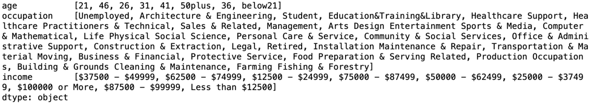
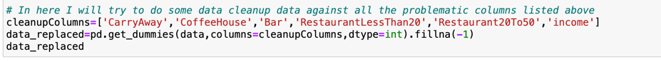

# Will a Customer Accept the Coupon?

**Context**

Imagine driving through town and a coupon is delivered to your cell phone for a restaraunt near where you are driving. Would you accept that coupon and take a short detour to the restaraunt? Would you accept the coupon but use it on a sunbsequent trip? Would you ignore the coupon entirely? What if the coupon was for a bar instead of a restaraunt? What about a coffee house? Would you accept a bar coupon with a minor passenger in the car? What about if it was just you and your partner in the car? Would weather impact the rate of acceptance? What about the time of day?

Obviously, proximity to the business is a factor on whether the coupon is delivered to the driver or not, but what are the factors that determine whether a driver accepts the coupon once it is delivered to them? How would you determine whether a driver is likely to accept a coupon?

**Overview**

The goal of this project is to use what you know about visualizations and probability distributions to distinguish between customers who accepted a driving coupon versus those that did not.

## Description

I have followed the CRISP data collection framework to collect and clean the data for analysis purpose.

1. I lookedup all the unique values for all the columns which non-numeric type and found out following columns needs
     datacleanup to derive value out of it
     
     
2. I have used the following methods to clean the data
    * fillna() - to fill the missing values with the mean of the column
    * dropna() - to drop the rows with missing values
    * replace() - to replace the values with the mean of the column
   
3. Then used 1-hot encoding to convert the categorical data to numeric data.
    
4. After cleaning the data, I have used the following pandas and plotly library to do my data analysis and plotting the outcome as meanful chats.
5. Following are my observations
   1. The more the person visits a bar, the more likely He/She will accept coupons. 
   2. Across any age group , we see the rate of acceptance is more when the number of bar visits in between 1 and 3.
   3. More coupons are accepted during lunch hours and evening times irrespective of kind of coupons.
   4. There is not much correltation between income and coupons acceptance.
   5. Weather does have impact on coupons acceptance. People tend to accept more coupons when the weather is sunny.